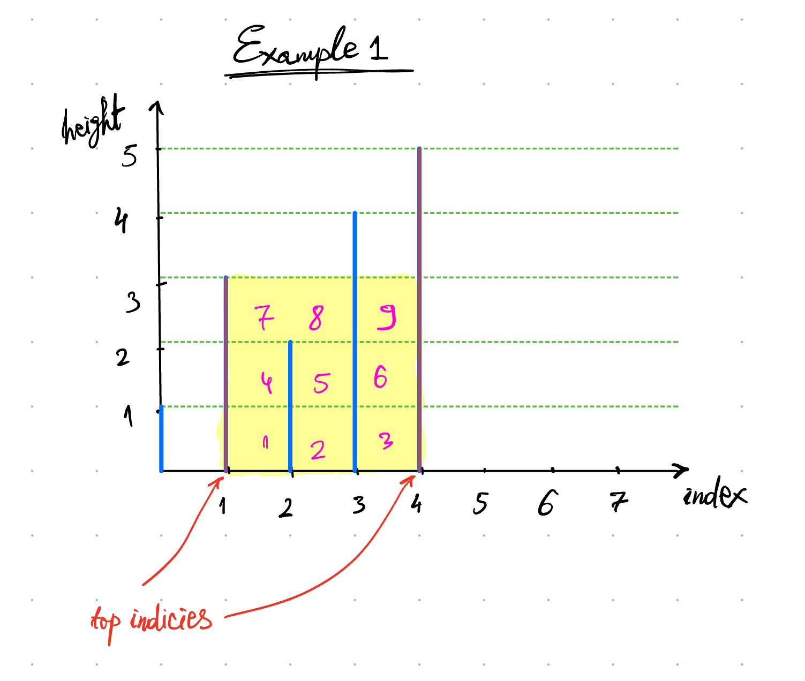
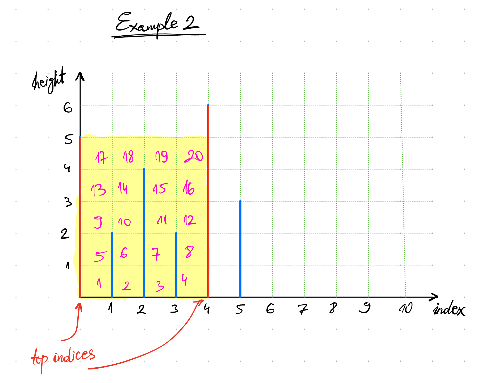
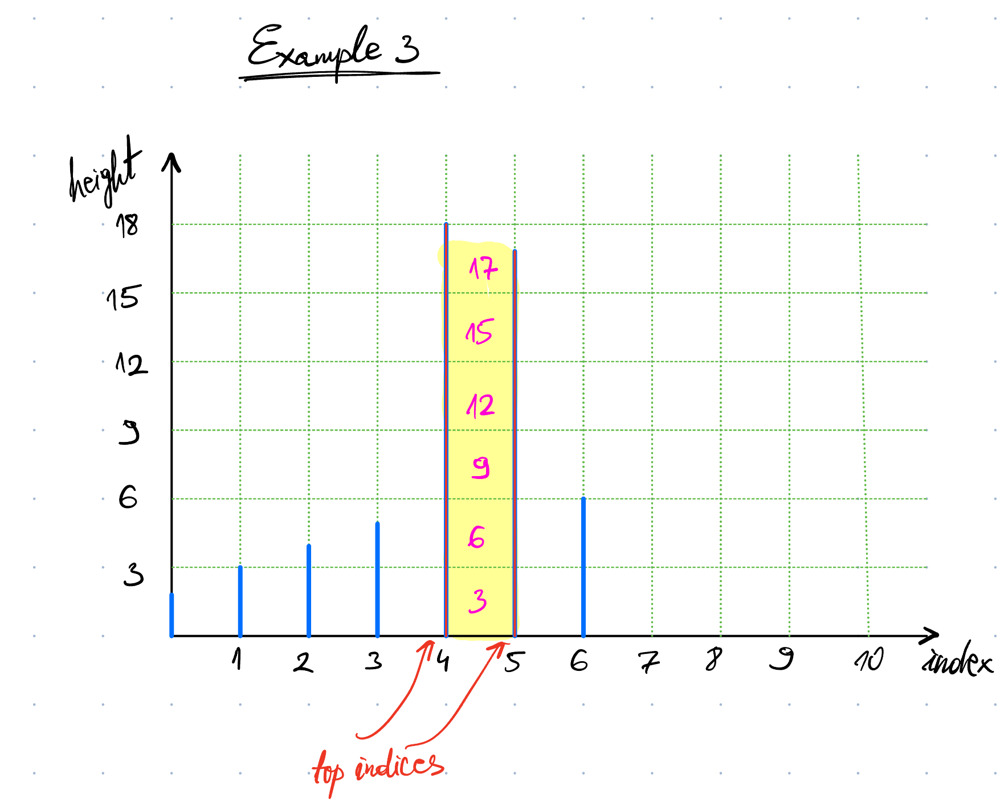

## Problem statement

Given an array of non-negative integers, where each integer represents the height of a vertical line positioned at index `i`. We need to find the two lines that, when combined with the x-axis, form a container that can hold the most water.

The goal is to find the maximum amount of water (area) that this container can hold.

_Note:_ The water container's width is the distance between the two lines, and its height is determined by the shorter of the two lines.

## Examples

Example 1:

**Input:** `[1,3,2,4,5]`

**Expected Output:** `9`

**Justification:** The lines at index `1` and `4` form the container with the most water. The width is `3 * (4-1)`, and the height is determined by the shorter line, which is `3`. Thus, the area is `3 * 3 = 9`.

---
Example 2:

**Input:** `[5,2,4,2,6,3]`

**Expected Output:** `20`

**Justification:** The lines at index `0` and `4` form the container with the most water. The width is `5 * (4-0)`, and the height is determined by the shorter line, which is `5`. Thus, the area is `5 * 4 = 20`.

---

Example 3:

**Input:** `[2,3,4,5,18,17,6]`

**Expected Output:** 17

**Justification:** The lines at index `4` and `5` form the container with the most water. The width is `17 * (5-4)`, and the height is determined by the shorter line, which is `17`. Thus, the area is `17 * 1 = 17`.

