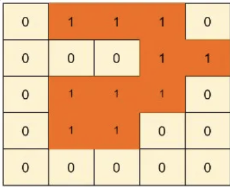
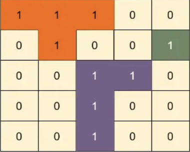

## Problem statement

Given a 2D array (i.e., a matrix) containing only 1s (land) and 0s (water), count the number of islands in it.

An island is a connected set of 1s (land) and is surrounded by either an edge or 0s (water). Each cell is considered connected to other cells horizontally or vertically (not diagonally). 

### Example 1:

Input: `matrix =`

Output: `1`

Explanation: The matrix has only one island. See the highlighted cells below.

### Example 2

Input: `matrix =`

Output: `3`

Explanation: The matrix has three islands. See the highlighted cells below.

